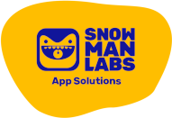
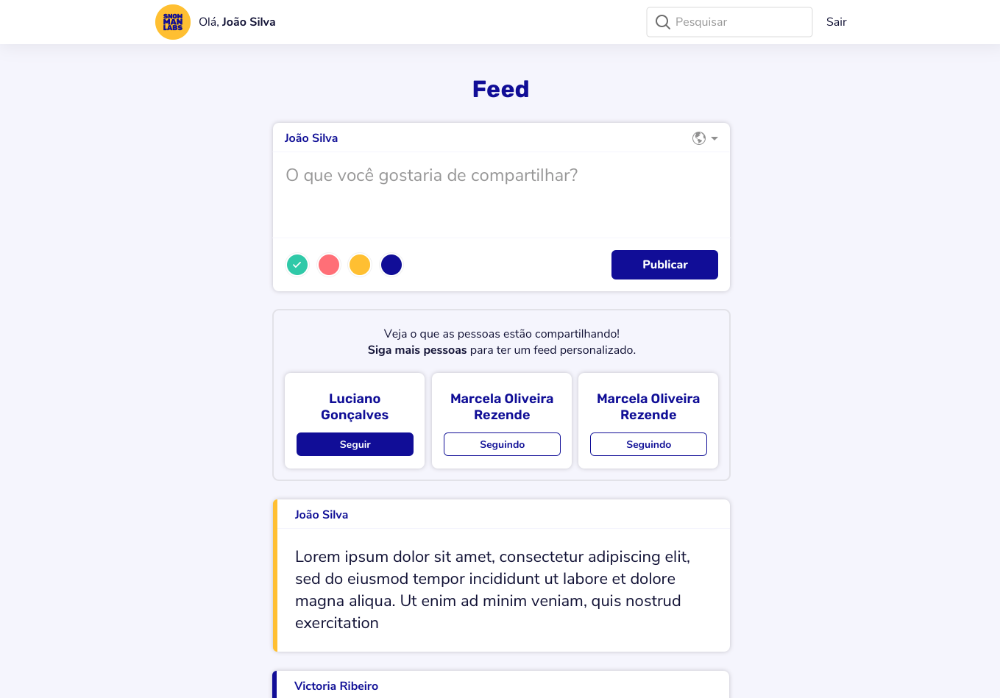

 

  

  <h3 align="center">Full-stack Challenge :trophy:</h3>

  

    :suspect: How do you solve problems? :godmode:
     
     
    <a href="https://www.snowmanlabs.com.br/snow-team/">SnowTeam</a>
    ·
    <a href="https://groups.google.com/a/snowmanlabs.com/forum/#!forum/dev.challenge">Questions about the challenge</a>
    ·
    <a href="https://invis.io/AH10GJWZ3EV6">All InVision Screens</a>
  

## Table of Contents
- [Challenge Description](#challenge-description)
  - [Goal](#goal)
  - [Requirements](#requirements)
  - [User Stories](#user-stories)
  - [Deliverables](#deliverables)
  - [Evaluation](#evaluation)
  - [Bonus Deliverable](#bonus-deliverable)
  - [Questions?](#questions)

# Challenge Description

     
    
     
    <a href="https://invis.io/AH10GJWZ3EV6">
        All InVision Screens »
    </a>
     

We want to understand you better, so do not be afraid of failing, this is not a matter of right and wrong. Just do your best. Good luck! :smile:

## Goal

:snowman: Your team is developing a Twitter-like website. Your task is to create a Front-End and API for this project.

## Guidelines
### Front-end
You may choose to use:
* plain **Javascript**, but we encourage you to use **TypeScript** if you feel comfortable to.
* a framework (we use Vue.js here, but if you feel more confident using another one, no problem). If you are feeling really :godmode: badass, do it vanilla.
* a CSS Preprocessor, *webpack*, *Babel* and other tools.
* any piece of technology you might find necessary (or cool).

It must:
* be built in *components*. We are very focused on componentization.
* be easy to set up and deploy. :children_crossing:
* use **Nunito** and **Rubik** font families.

We encourage you to use a UI framework. The less CSS you write, the better.

### Back-end
You may choose to use:
* your favorite language.
* your favorite database.
* a framework or not.
* any piece of technology you think is necessary or relevant.

It must:
* implement tests.
* be easy to set up and deploy. :children_crossing:

Atomic commits make it easier for us to understand the evolution of your line of reasoning.

## User Stories

As an anonymous user I want to:
* see list of random public posts at home page.
* signup / sign in with email/password.
* (bonus) signup / sign in with Facebook/Google

As logged-in user, I want to:
* see my feed with private and public posts from users I follow.
* see suggestions of new users to follow, if user isn't following anyone yet
* create new posts (content, color, visibility)
* search for users to follow
* see users pages
* follow/unfollow users
* (bonus) see my feed updating in realtime

## Deliverables

* The source code in a public git repository.
* A public live demo (eg. Netlify/Heroku).
* An Swagger/OpenAPI documentation.
* Instructions on how to run the development environment.
* Instructions on how to deploy.

## Evaluation

The evaluation will follow the criteria below.

* :dart: Good practices.
* :wrench: Code maintainability.
* :rocket: Performance.
* :see_no_evil: Privacy.
* :eyes: Data security.
* :dizzy: Data consistency.
* :watch: Full operation.
* :factory: Robustness.
* :earth_americas: Scalability.

## Bonus Deliverable

We would really enjoy if you would take us through your decision making process in some way. It doesn't need to be deep, just a general glance of it. As a bonus, if you are feeling like an [awesome developer streamer](https://github.com/bnb/awesome-developer-streams) :blush: :tv:, we would like to see a video of your development process. It would allow us to better understand you and give you a more complete feedback.

## Questions?

If you have any questions about this challenge, you can open a new topic or search for your question at the [Dev Challenge Forum](https://groups.google.com/a/snowmanlabs.com/forum/#!forum/dev.challenge). :love_letter:
